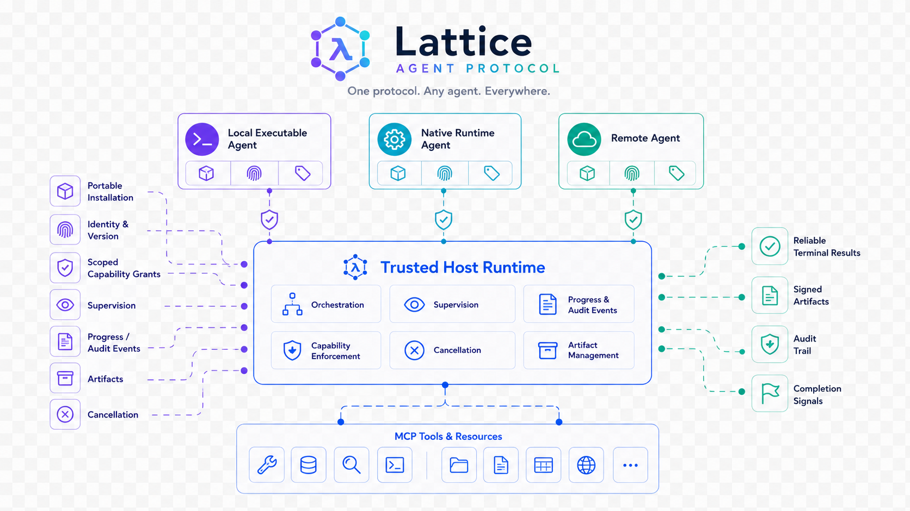

# LAP: Lattice Agent Protocol

[](https://github.com/lambda-harness/LAP/actions/workflows/verify.yml)
[](SPEC.md)
[](LICENSE)
[](.github/workflows/verify.yml)

> **Orchestrate Any Agent. Connect Everything.**

Most agent stacks can invoke a tool, but cannot safely make independently
built Agents installable, identifiable, governed, observable, and composable.
LAP gives a Host Runtime one portable lifecycle contract for admitted local
executables, native runtime Agents, and remote Agents, so they can work
together without giving up tenant boundaries or operational control.

LAP is deliberately narrow. It does **not** replace existing standards:

- [MCP](https://modelcontextprotocol.io/) connects models and agents to tools,
  resources, and prompts.
- [A2A](https://a2a-protocol.org/latest/) connects independent remote agents.
- LAP defines the lifecycle and runtime contract for installable, governed
  Agents, including local binaries and A2A-backed Agents.

## One Contract, Many Agent Implementations

<p align="center">
  
</p>

LAP governs the Agent boundary. MCP remains the tool and resource boundary;
A2A remains the remote-agent interoperability boundary. The Host Runtime is
the control point that admits releases, grants capabilities, supervises runs,
and records results.

## Quick Start

LAP is a specification and conformance kit. You can validate the Local Profile
without a hosted service, API key, or global installation.

**Prerequisites:** Git and Python 3.11 or later. Node.js 18 or later is
needed only to run the Node.js reference Agents. Public CI verifies Python
3.11, 3.12, and 3.13, plus Node.js 22.

### 1. Clone and prepare the environment

```bash
git clone https://github.com/lambda-harness/LAP.git
cd LAP
python -m venv .venv
```

Activate the environment with PowerShell on Windows:

```powershell
.\.venv\Scripts\Activate.ps1
```

Or activate it with a POSIX shell on macOS or Linux:

```bash
source .venv/bin/activate
```

### 2. Install the checks and run the published exchange

```bash
python -m pip install --upgrade pip
python -m pip install -r requirements-dev.txt
python -m unittest discover -s tests -p "test_*.py" -v
```

The suite validates the published schemas and vectors, then drives the Python
echo Agent through a real stdin/stdout LAP exchange. When Node.js, Go, or
Cargo is on `PATH`, it also exercises the matching reference implementation.

### 3. Probe an external Agent package

An Agent author can run one bounded, machine-readable Local wire probe against
the exact entry point declared in any package's `agent.json`:

```bash
python tools/lap_local_probe.py --package /path/to/my-agent
```

For a package with multiple capabilities, select one and provide its valid JSON
input explicitly:

```bash
python tools/lap_local_probe.py --package /path/to/my-agent \
  --capability task.run \
  --input '{"task":"verify the release"}'
```

The probe never invokes a shell. It validates the package manifest, selected
input and successful output contracts, Local handshake identity, ordered stdout
frames, correlation, run identity, and one terminal result. It executes only
the command already declared by the package, so run it only for code you are
willing to execute. Its JSON report intentionally omits the probe input, raw
Agent output, command arguments, and package paths. It is Agent-side evidence,
not a Host Runtime certification or authorization boundary.

### 4. Choose the next integration path

- **Build a local Agent:** start with the runnable
  [Python](examples/echo-agent/README.md),
  [Node.js](examples/echo-agent-node/README.md),
  [Go](examples/echo-agent-go/README.md), or
  [Rust](examples/echo-agent-rust/README.md) echo Agent. For a Host-governed
  multi-Agent workflow, use the runnable
  [Python](examples/orchestrator-agent/README.md),
  [Node.js](examples/orchestrator-agent-node/README.md), or
  [Go](examples/orchestrator-agent-go/README.md) external orchestrator Agent.
- **Build a Host Runtime:** read the [Core Specification](SPEC.md), then use
  [Conformance](CONFORMANCE.md) to make a reproducible implementation claim.
- **Compose a governed workflow:** use the
  [Workflow Profile](profiles/workflow.md) and the validated
  [workflow example](examples/release-check.workflow.json).

## Why LAP

An Agent is more than a prompt or a tool. A portable Agent needs an identity,
version, declared capabilities, a transport, a health contract, scoped
permissions, observable progress, cancellation, artifacts, and a dependable
terminal result. Without those contracts, "plug-in agents" become arbitrary
process execution with unreliable handoffs.

LAP standardizes that missing boundary.

```text
Agent package -> Registry -> Supervisor -> Adapter -> Agent implementation
                                      |-> policy / approval
                                      |-> events / audit / artifacts
```

## What LAP Covers

| Concern | LAP answer |
|---|---|
| Discover and install | Versioned `agent.json` manifest, declared profiles, and package profile. |
| Run a local binary | `lap-local` UTF-8 NDJSON over supervised stdin/stdout. |
| Invoke a remote agent | `lap-a2a-bridge`, using negotiated A2A semantics. |
| Observe work | Ordered progress, artifact, and terminal events. |
| Stop and retry safely | Idempotency keys, deadlines, cancellation, immutable terminal states. |
| Govern a tenant | Runtime-derived tenant identity and scoped capability grants. |
| Compose agents | Parent/child lineage plus immutable Agent and capability scopes for a trusted supervisor. |

## Documents

- [Core Specification](SPEC.md): terms, envelope, lifecycle, governance, and
  compatibility rules.
- [Local Stdio Profile](profiles/local-stdio.md): the normative local-process
  transport for a supervised external Agent implementation.
- [A2A Bridge Profile](profiles/a2a-bridge.md): interoperability rules for
  managed remote A2A agents.
- [A2A Inline Inputs Profile](profiles/a2a-inline-inputs.md): optional,
  bounded transfer of explicitly granted small Host input artifacts to an
  admitted A2A Skill using A2A `FilePart.bytes`.
- [Package Signing Profile](profiles/package-signing.md): optional Ed25519
  publisher provenance for portable Agent Packages.
- [Workflow Profile](profiles/workflow.md): user-owned, versioned Agent graphs
  with runtime-enforced dispatch boundaries and a portable external-orchestrator
  planning context.
- [Host Metering Profile](profiles/host-metering.md): optional direct-model
  Host accounting for enforceable workflow input and cost budgets.
- [Model Relay Profile (Draft)](profiles/model-relay.md): a reviewed path for
  Host-observed model requests from an external Local Agent; it does not yet
  weaken the current fail-closed external-budget rule.
- [Go Agent SDK](sdk/go/README.md): dependency-free Agent-side helper for the
  Local Profile; it is not a Host Runtime or a conformance certification.
- [Agent Manifest](schemas/agent-manifest.schema.json),
  [Envelope](schemas/envelope.schema.json),
  [Context Packet](schemas/context-packet.schema.json), and
  [Run Result](schemas/run-result.schema.json),
  [Workflow](schemas/workflow.schema.json),
  [Orchestrator Context](schemas/workflow-orchestrator-context.schema.json),
  [Orchestrator Output](schemas/workflow-orchestrator-output.schema.json), and
  [Package Signature](schemas/package-signature.schema.json) schemas:
  machine-readable contracts.
- [Conformance Report](schemas/conformance-report.schema.json) Schema: a
  machine-readable record of an implementation's reproducible claim.
- [Conformance](CONFORMANCE.md): required tests and conformance claims.
- [Conformance Kit](conformance/README.md): portable vectors, report example,
  and the exact verification command.
- [Local Agent Probe](tools/lap_local_probe.py): an author-side executable
  check for one declared `lap-local/0.1` capability without a Host Runtime.
- [Governance](GOVERNANCE.md): versioning and change process.
- [LAP Enhancement Proposals](proposals/README.md): public design records for
  normative, compatibility, and security changes.

## Draft Migration

The current draft uses `lap-workflow/0.2` and
`lap-a2a-inline-inputs/0.2` under the canonical
`io.github.lambda-harness.lap.*` namespace. The former `0.1` profile and key
identifiers are historical records, not aliases. Upgrade an external workflow
Agent by rebuilding its package, updating its declared and negotiated profile,
then re-activating the exact release; a Host never sends both Context Packet
keys for compatibility. See [LEP-0008](proposals/LEP-0008-canonical-profile-namespaces.md).

## Minimal Local Package

```text
my-agent/
  agent.json
  bin/
    <agent-entrypoint>
  lap-signature.json  # optional, signed publisher provenance
```

The runtime validates the manifest, starts the process, negotiates LAP, and
only then marks the release active. Finding a binary on disk is never
permission to execute it.

When a Local package declares `profiles`, the declaration makes its intended
contracts visible for discovery and workflow preflight. It never grants
authority or replaces the required per-Run profile negotiation.

A Host MAY also probe a declared dependent profile during activation. Any
successful activation verification is Host-local evidence bound to the exact
validated release; it grants no authority and never replaces the required
per-Run negotiation.

See the [echo-agent example](examples/echo-agent/README.md) for a runnable
Python reference conversation, the [echo-agent-node example](examples/echo-agent-node/README.md)
for a Node.js implementation of the same `lap-local` exchange, the
[echo-agent-go example](examples/echo-agent-go/README.md)
for a Go implementation of the same `lap-local` exchange, the
[echo-agent-rust example](examples/echo-agent-rust/README.md) for a Rust
implementation, the [orchestrator-agent-node example](examples/orchestrator-agent-node/README.md)
for a Node.js external workflow planner, the
[orchestrator-agent-go example](examples/orchestrator-agent-go/README.md) for a Go external
workflow planner, and
[release-check.workflow.json](examples/release-check.workflow.json) for a
validated workflow graph.

## Design Principles

1. **Compatibility before replacement.** Reuse A2A and MCP rather than create
   a competing wire protocol for their domains.
2. **Runtime-enforced governance.** An agent may request work; only the host
   runtime may authorize, dispatch, approve, cancel, or finalize it.
3. **Hot reload without ambiguity.** New runs resolve one immutable release;
   old releases drain instead of changing beneath an in-flight task.
4. **Observability without hidden reasoning.** Progress describes real
   operations and outcomes, not private chain-of-thought.
5. **Tenant identity is authoritative.** The authenticated host establishes
   it; an agent cannot select or broaden it.

## Status and Scope

`0.1.0-draft` is intended for design review and reference implementations. It
is not yet a stable compatibility promise. Implementers should report gaps via
issues or a LAP Enhancement Proposal before depending on it in production.

The first conformance target is a local executable integrated by an independent
host in under 30 minutes. The published Python, Node.js, Go, and Rust
references exercise the same vector so the Local Profile is not coupled to one
language runtime. Remote discovery and delegated authorization are intentionally
layered on top of that target. The workflow graph is specified in this draft; a
production reference executor follows the Local Profile.

## Contributing

Read [GOVERNANCE.md](GOVERNANCE.md). Changes to normative language, schemas, or
profiles require a versioned proposal and conformance impact analysis. Start
with the [LEP template](proposals/LEP-template.md).
